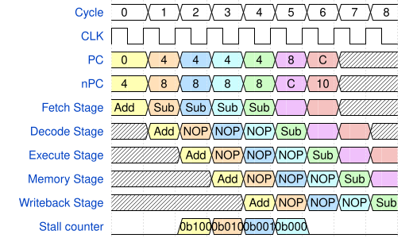
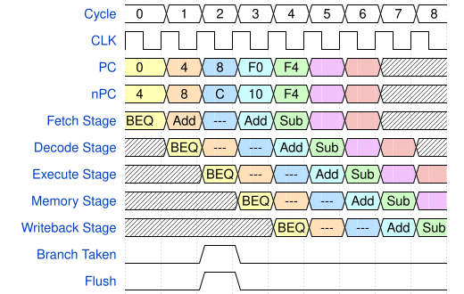
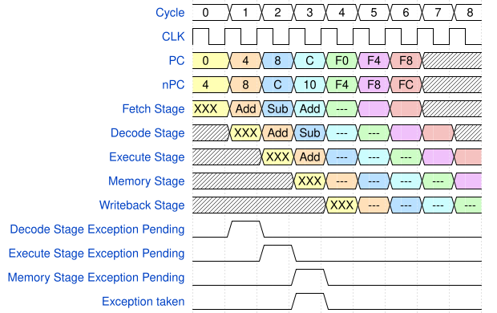
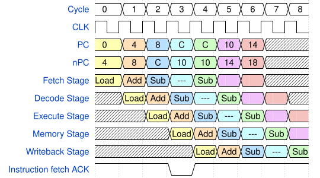

# Pipeline design

By pipelining the CPU, it is possible to more efficiently execute instruction by overlapping the execution.

Due to the synchronous implementation of the used memories, the instruction is natrually split into different steps. Specifically, at least the following 4 steps are created naturally by the usage of the synchronous memories.

1. Reading instruction from memory (synchronous memory read)
2. Reading register value from register file (synchronouse read from register file)
3. Store or load to or from memory (synchronous memory write or read)
4. Writing value back to register file (synchronouse write to register file)

This naturally offers to use a [classic RISC Pipeline](https://en.wikipedia.org/wiki/Classic_RISC_pipeline) for this cpu.

This pipeline desig uses the following stages:

1. Instruction Fetch
2. Instruction Decode
3. Execute
4. Memory Access
5. Writeback

This matches the steps with needed synchronous memory access plus the ALU operation which typically contains long combinatorial chains where an additional pipeline stage can help split the critical path and raising the frequency.

Between each step, registers can be used to store the values. If one instruction finished one of the pipeline stages, the next instruction can already execute this stage. Values read from memory are not specifically stored in a pipeline stage register but the output of the synchronous memory can be used.

## Hazards

Pipeline CPU architectures creates so called hazards where the execution order might have side effects or impact due to the pipeline. For example, in case an instruction relies on the result of the previous instruction but the result is not available in time for the second instruction to correctly work. For pipeline CPUs, different hazards are identified.

### Structural Hazard

The structural harzard means, that resources are needed in different stages. For example if the adder is needed in the execute and in the decoder stage, they can not be executed in parallel. This is handled by ensuring that each stage has all the resources availble needed to perform the defined task.

In the current CPU implementation, the structural hazard is created by the von Neuman architecture where data and instructions are stored in the same single port memory. In case of a load or store instruction the memory access and the fetch stage are conflicting on the memory interface. To simplify the implementation, this hazard will be solved by delaying the fetch stage in case of a load or store instruction.

A more sofisticated implementation would be to use a hardware architecture within the CPU which would need separate instruction and data caches. This might be a future improvement if needed.

### Data hazard

The data hazard triggers, if two instruction need each others data. For example, if one instruction changes register r1 and the next instruction needs r1 as input, the data calculated by the first instruction is not available in the register file at the time the value from r1 is read. If this hazard is not dealt with, instructions would act on stale (invalid) data which will lead to the wrong results.

To increase performance, it would be possible to create a shortcut where the result of the execute stage is feed back to the next instruction if needed where the result is used before it is written into the register file.

However, to keep the CPU design simpler, this will not be implemented for now. Instead, if the decoder determines an occurance of the data hazard, it will inject NOP instructions and not increase the PC until enough NOP instructions are put into the pipeline to ensure the instruction result is written into the register file before the next instruction is started. This will reduce the performance but simplify the CPU design.

### Control hazard

The control hazard means, that in case of jump and branches, the branch or jump target as well as the branch condition is only evaluated later in the pipeline. Specifically at the execute stage. This is already too late for the fetch stage. To keep the CPU design simple, a "static branch predition" will be implemented which means, the CPU always assume that the next instruciton is in PC+4 (in case of branches it is assumed the branch is not taken). As most instruction are neither branches nor jump instruction, this will already be correct for these cases. In case of a branch or jump, the CPU would invalidate the instruction which already have been issued after the branch or jump.

## Implementation

### Data Hazard

To handle the data hazard, the decoder has to track which registers are about to be written by the instructions currently in the pipeline. For this, the decoder needs to track each register and remember when the last instruction for each register was processed.

The only exception is register x0 as this register is always bound to 0 so there is no data hazard.

When an instruction is executed, it takes 3 clock cycles from the decode stage to the write back stage (execute->memory access->write back).

> [!NOTE]
> In the current CPU architecture, memory access takes 1 clock cycle so all instructions are handled the same. If the memory sub system needs additional clock cycles, this will need to be updated accordingly.

For each of the 31 registers, the decoder will have a 3 bit field. This field will use a one hot approach to where only one bit will be set at the time. When a register is specified as rd, a value of 0b100 is written into the scoreboard entry for this register. Every clock cycle the entry is shifted right by 1. After 3 clock cycles, the value is back to 0.

The decoder then has to check the scoreboard entries for RS1 and RS2 against 0.

As long as these entries are not 0 a NOP will be issued. The shift by 1 is very cheap in the implementation as it is only wireing between the flip flops. The check against 0 can be done by just or'ing the bits of the scoreboard entry.

The principle of the data hazard handling is shown in the graphic below. In this example, the add instruction stores the result in register X while the sub instruction uses X as a source register triggering the data hazard.

As can be seen, the decode stage does not progress with the sub instruction until the add instruction finished the writeback stage. The stall counter is also shown to indicate how the decoder tracks how many NOP need to be dispatched.

### Control hazard

In case of a jump or branch, the target as well as the branch condition is evaluated at the execute stage. To keep the critical path shorter, the result of the branch/jump instruction will be registered at the execute stage and then used to as the new PC in the fetch stage.

An example of a jump or branch control flow is shown below. When the execute stage executed, the PC changes to the branch target and the instructions issued before are invalidated inidcated by the "---".

In case of an exception, the control transfer is done different. All exception (even if they are triggered in an earlier stage) are handled in the memory stage. This is done, so it is always clear which instructions have to finished and which ones are not allowed to retire.

An example of an exception handling is shown below. Here the instruction XXX is an illegal instruction which is detected in the decode stage. However, the exception pending flag is then propagated with the instruction through the pipeline and will trigger the reaction in the memory stage. This guarantees, that exceptions are handled in the order they are triggered by instructions.

### Structural hazard

As the Fetch stage now does not fetch a new instruction every clock cycle, a handshake between the decode and the memory interfaces needs to be implemented. Here the delay can happen from two sources, either the decoder is not ready to fetch a new instruction (as NOP instructions need to be issued due to data hazard detection) or the memory interface has to handle a load or store instruction and can not fetch a new instruction.

An example of a structural hazard is shown below. In this case, the load instruction needs the load/store unit to load the data as needed. In this case, the fetch stage is stalled and a NOP instruction is issued.

