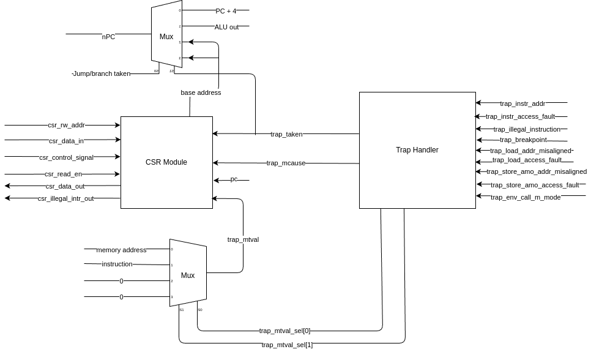

# Privileged Architecture Documentation

This readme documents the design and thoughts behind the privileged architecture of the CPU. It also includes the already adapted register values specific for this project.

## Overview

The privileged RISC-V architecture defines a address space of up to 4096 registers, although not all of them are used. Additionally, the privileged architecture includes different privilege levels and specific registers per privilege level. The following privilege levels are defined:

* Machine Mode (M): The highest privilege level.
* Supervisor Mode (S): The next highest privilege level.
* User Mode (U): The lowest privilege level.

In this project, only the Machine Mode (M) is used. Therefore, only machine mode registers are used and discussed further.

## Registers to be considered:

### TL;DR

This register will need to be implemented in the CPU. All other registers will only return 0. Detailed analysis can be found below.

* mstatus
* misa
* mtvec
* mtval
* mscratch
* mepc
* mcause

These registers are needed if interrupt sources are implemented:

* mie
* mip

### misa

The MISA register contains information about the architecture, specifically the width of the CPU (32 or 64 bits) as well as the supported extensions.

The standard defines, that extensions might be enabled/disabled by writing to this register. However, this project will not support the enable/disable of extensions. Therefore, this register will be read-only.

As only the RV32I extension is supported, the MISA register will contain the following value: 0x40000100.

### mvendorid

This register is read only and contains the manufacturer JEDEC ID of the CPU. As this is a non-commercial implementation, this register will return 0.

### marchid

This read only register contains the architecture ID of the CPU. This CPU does not have an architecture ID, so this register will return 0.

### mimpid

This read only register contains the version of the CPU implementation. To ease implementation, this register will return 0.

### mhartid

This read only register contains the hardware thread ID of the CPU. This is a single core CPU and according to the standard at least one hart must have an ID of 0. Therefore, this register will return 0.

### mstatus

The MSTATUS register contains various status bits. The following bits are defined at set to the following values:

* SIE: Supervisor Interrupt Enable - Set to 0 as Supervisor mode is not supported.
* MIE: Machine interrupt Enable - Contains the interrupt enable bit
* SPIE: Supervisor Previous Interrupt Enable - Set to 0 as Supervisor mode is not supported.
* UBE: User Mode Big Endian - Set to 0 as User mode is not supported.
* MPIE: Machine Previous Interrupt Enable - Contains the interrupt enable bit status prior to the current interrupt.
* SPP: Supervisor Previous Privilege - Contains the privilege level status prior to the current interrupt. Reads as 0 as Supervisor mode is not supported.
* VS: Vector unit state - Reads as 0 as Vector unit is not supported.
* MPP: Machine Previous Privilege - Contains the privilege level status prior to the current interrupt. Set to 0b11 to indicate Machine mode as this is the only supported privilege level.
* FS: Floating-Point state - Reads as 0 as Floating-Point unit is not supported.
* XS: State of additional extensions - Reads as 0 as no additional extensions are supported.
* MPRV: Modified Privilege - Modifies the load and store privilege level based on the value of the MPP field. Reads as 0 as only machine mode is supported.
* SUM: Supervisor User Memory access - Modifies the load and store privilege level when in supervisor mode. Reads as 0 as only machine mode is supported.
* MXR (Make eXecutable Readable): Modifies when accessing virtual memory. Reads as 0 as only machine mode is supported.
* TVM (Trap Virtual Memory): Set to 0 as only machnine mode is supported.
* TW (Timeout Wait): Modifies the WFI instruction. If TW is set to 0, WFI can be executed in a less privileged mode. Will always read as 0 as only machine mode is supported.
* TSR (Trap SRET): Intercepting SRET instruction. Reads as 0 as only machine mode is supported.
* SPLEP (Supervisor Previous Expected Landing Pad): Field added by Zicflip extension. Reads as 0 as Zicflip extension is not supported.
* SDT (S-mode-disable-trap): Reads as 0 as only machine mode is supported.
* SD: Bit summarizing the state of FS, VS and XS. As these bits always read as 0, this field also will always read as 0.

**Conclusion**: Only the following bits need to be considered: MIE and MPIE. MPP can be hard-wired to 0b11. All other fields can/will be hard-wired to 0.

### mstatush

This is the high half of the MSTATUS register. It contains the following bits:

* SBE (Supervisor Big Endian): Set to 0 as Supervisor mode is not supported.
* MBE (Machine mode Big Endian): - Set to 0 as Big Endian mode is not supported.
* GVA (Guest Virtual Address): Set to 0 as Virtual Addressing is not supported.
* MPV (Machine Previous Virtualization Mode): Set to 0 as Virtualization is not supported.
* MPELP (Machine Previous Expected Landing Pad): set to 0 as Zicflip extension is not supported.
* MDT (M-mode-disable-trap): Set to 0 as Smdbltrp extension is not supported.

**Conclusion**: The MSTATUSH register can be hard-wired to 0.

### mtvec

This register cotains the interrupt vector base address. The interrupt vector base address is the address of the first interrupt handler in the memory. The lower two bits indicate if the interrupt is vectored or direct.

This register has to be reset to a meaningful value but should be able to be overwritten to support different software settings.

### medeleg

This register is the machine exception delegation register. It is used to control if an exception is allowed to be handled on a lower privilege level. As only machine mode is supported, this register can be hard-wired to 0.

### mideleg

This register is the machine interrupt delegation register. It is used to control if an interrupt is allowed to be handled on a lower privilege level. As only machine mode is supported, this register can be

### mip

Machine interrupt pending register. The lower 15 bits correspond to the standard interrupt sources. The upper 16 bits are platform specific and can be defined as needed.

As currently no interrupts are implemented, this register can be hard-wired to 0 for now. In case interrupts will be added, this register has to be implemented accordingly.

### mie

Machine interrupt enable register. The lower 15 bits correspond to the standard interrupt sources. The upper 16 bits are platform specific and can be defined as needed.

As currently no interrupts are implemented, this register can be hard-wired to 0 for now. In case interrupts will be added, this register has to be implemented accordingly.

### performance monitoring counters

The performance monitoring counters are not mandatory. The cycle and minstret counters can be very useful. However, in a first implementation, these counters can be hard-wired to 0.

### mcounteren

Machine counter enable register. As the performance monitoring counters are not mandatory, this register can be hard-wired to 0.

### mcountinhibit

Machine counter inhibit register. As the performance monitoring counters are not mandatory, this register can be hard-wired to 0.

### mscratch

Machine scratch register. This register can be used to store temporary data during interrupt handling. This will be implemented to provide a basic register to store a word.

### mepc

Machine exception program counter register. This register contains the address of the instruction that caused the exception. The CPU has to store the instruction which triggers the exception in this register before jumping to the exception handler.

### mcause

Machine cause register. This register contains the cause of the exception or interrupt. Bit 31 indicates if it is a interrupt(1) or an exception(0). The CPU has to map the incoming causes to the corresponding values.

The valid values are (values that are striken through are not supported by this CPU and therefore not implemented):

| Interrupt | Exception Code | Description |
|-----------|----------------|-------------|
| 1 | 0 | Reserved |
| 1 | 1 | ~~Supervisor software interrupt~~ |
| 1 | 2 | Reserved |
| 1 | 3 | Machine software interrupt |
| 1 | 4 | Reserved |
| 1 | 5 | ~~Supervisor timer interrupt~~ |
| 1 | 6 | Reserved |
| 1 | 7 | Machine timer interrupt |
| 1 | 8 | Reserved |
| 1 | 9 | ~~Supervisor external interrupt~~ |
| 1 | 10 | Reserved |
| 1 | 11 | Machine external interrupt |
| 1 | 12 | Reserved |
| 1 | 13 | ~~Counter-overflow interrupt~~ |
| 1 | 14-15 | Reserved |
| 1 | >= 16 | Designated for platform use |
| 0 | 0 | Instruction address misaligned |
| 0 | 1 | ~~Instruction access fault~~ |
| 0 | 2 | Illegal instruction |
| 0 | 3 | ~~Breakpoint~~ |
| 0 | 4 | Load address misaligned |
| 0 | 5 | ~~Load access fault~~ |
| 0 | 6 | Store/AMO address misaligned |
| 0 | 7 | ~~Store/AMO access fault~~ |
| 0 | 8 | ~~Environment call from U-mode~~ |
| 0 | 9 | ~~Environment call from S-mode~~ |
| 0 | 10 | Reserved |
| 0 | 11 | Environment call from M-mode |
| 0 | 12 | ~~Instruction page fault~~ |
| 0 | 13 | ~~Load page fault~~ |
| 0 | 14 | Reserved |
| 0 | 15 | ~~Store/AMO page fault~~ |
| 0 | 16 | ~~Double trap~~ |
| 0 | 17 | Reserved |
| 0 | 18 | ~~software check~~ |
| 0 | 19 | ~~Hardware error~~ |
| 0 | 20-23 | Reserved |
| 0 | 24 - 31 | Designated for platform use |
| 0 | 32- 47 | Reserved |
| 0 | 48 - 63 | Designated for platform use |
| 0 | >= 64 | Reserved |

### mtval

Register to provide additional information in case of an exception or interrupt. 

This is needed to correctly handle specific exceptions (e.g. misaligned load/store instruction).

The following values will be written to this register:

| Exception | Additional Information |
|-----------|---------------------|
| Instruction address misaligned | PC of the instruction that caused the exception |
| Instruction access fault | PC of the instruction that caused the exception |
| Illegal instruction | The instruction that caused the exception |
| Load misalignment | Address where to load from |
| Load access fault | Address where to load from |
| Store/AMO address misalignment | Address where to store/AMO |
| Store/AMO access fault | Address where to store/AMO |

All other exceptions and interrupts will have a value of 0 in this register.

### mconfigptr

This register contains a pointer to a configuration structure that contains additional information about the machine. This is not mandatory and can be hard-wired to 0.

### menvcfg

This register contains an environment configuration value. This is not mandatory and can be hard-wired to 0. This register is only needed in case S or U mode are implemented which are not supported in this CPU.

### mseccfg

This register contains security configuration values. This is only needed if security features are implemented which are not supported in this CPU. Therefore, this register can be hard-wired to 0.

## Implementation of the Zicsr extension and CSR register file

The Zicsr extension is part of the non privileged specification but is required to access the privileged CSR registers and therefore to support exceptions and interrupts.

Due to the small size of CSR to be supported and the atomic behavior of the Zicsr instructions, a separate CSR module is needed to handle the Zicsr instructions.

The following instructions need to be implemented to support the Zicsr extension:

* CSRRW: Atomic read and write to a CSR. This instruction swaps the value of a CSR with the value in a register. If the target register is x0, the read should not have any side effects. Therefore, **the CSR module has to be aware if a read should happen or not.**
* CSRRS: Atomic read and set BIT. The input value is a mask indicated which bits of the CSR to set. The old value of the CSR is written into the target register. The CSR is always read with side effects. Therefore, **the CSR module has to have an input indicating that the input value is a set mask.**
* CSRRC: Atomic read and clear BIT. The input value is a mask indicated which bits of the CSR to clear. The old value of the CSR is written into the target register. The CSR is always read with side effects. Therefore, **the CSR module has to have an input indicating that the input value is a clear mask**
* CSRRWI: Similar to CSRRW but the input is an immediate value from the insturction. The decoder has to be aware of this and be able to switch between immediate and register input. Other then that, no additional requirements for the CSR module are needed.
* CSRRSI: Similar to CSRRS but the input is an immediate value from the insturction. The decoder has to be aware of this and be able to switch between immediate and register input.
* CSRRCI: Similar to CSRRC but the input is an immediate value from the insturction. The decoder has to be aware of this and be able to switch between immediate and register input

### CSR module signals

Based on the Zicsr extension instructions, the following signals need to be implemented:

* csr_rw_addr: 12 bits, the address of the CSR register to be worked on
* csr_data_in: 32 bits, the data to be written to the CSR register or containing the mask for CSRRS and CSRRC. This signal will need to be connected to a multiplexer to select between immediate and register inputs
* csr_data_out: 32 bits, the data read from the CSR register. This needs to be connected to the mux feeding data to the general purpose registers
* csr_control_signal: 2 bits. This signal indicates if the data coming in needs to be written directly to the CSR, needs to be intepreted as a set mask, intepreted as a clear mask or if no action needs to be taken. With the following mapping:
  * 00: No write
  * 01: Write data to CSR
  * 10: Set bits in CSR
  * 11: Clear bits in CSR
* csr_read_en: 1 Bit, signal to indicate if a read operation is needed

To additionally support the CSR content base on the signals within the CPU, the following additional signals need to be implemented:

* csr_exception_in: 4 bits, the exception or interrupt number that was triggered. This can be connected to some IRQ/EXC module. Or different signel bit input signals can be used and then mapped to the exception or interrupt number within the CSR module.
* csr_irq_in: 1 bit, signal to indicate if an interrupt was triggered.
* csr_exc_in: 1 bit, signal to indicate if an exception was triggered.
* csr_mtval_in: 32 bits, the additional information provided by the exception or interrupt. This can be connected to some IRQ/EXC module.
* csr_mepc_in: 32 bits, the program counter of the instruction that caused the exception or interrupt.
* csr_illegal_out: 1 bit, signal to indicate if an illegal instruction was triggered.
* csr_base_out: 32 bits, the base address of the trap table.

### Inclusing into CPU pipeline

As the read and write operation from/to the CSR have to happen atomically (value has to be read from general purpose registers, written to CSR and then written back to general purpose registers), the CSR module can be implemented to run in parallel to the load/store unit in the memory stage of the pipeline. At this point, the data from the general purpose register is available and after this stage, the write back stage of the pipelien can be used to write the new value back to the general purpose register.

## Implementation of trap handling

To handle traps, a trap handler will be implemented. This handler has single signal inputs per trap source. It then internally maps it to the cause and triggers the jump to the correct address based on the configured base address.

Note: A trap is describes both an interrupt (triggered by an external source) and exception (triggered by the CPU).

When a trap is triggered, the unit will set the registers in the CSR module according to the triggered trap.

### Trap handler signals

Interrupt and exception input signals:

* trap_instr_addr: Instruction address misaligned
* trap_instr_access_fault: Instruction access fault
* trap_illegal_instruction: Illegal instruction
* trap_breakpoint: Breakpoint
* trap_load_addr_misaligned: Load address misaligned
* trap_load_access_fault: Load access fault
* trap_store_amo_addr_misaligned: Store/AMO address misaligned
* trap_store_amo_access_fault: Store/AMO access fault
* trap_env_call_m_mode: Environment call from M-mode

Additionally, the following signals need to be exchanged between the trap handler and the CSR module and the rest of the CPU:

* trap_cause_out: 32 bits, the cause of the trap.
* trap_mtval_sel: 2 bits, multiplexer selection for the mtval input.
* trap_taken_out: 1 bit, signal to indicate if the trap has been taken.

### Points in the CPU pipeline where traps can occur

RISC-V defines traps to be precise traps, meaning every instruction can be either retired (exeuction finished, result is written into memory or into general purpose registers) or squashed (instruction stop execution before anything is written into memory or into general purpose registers).

Interrupts can be triggered at any point in time (asynchronously) and then are synchronized into the CPU within the trap handler. Exception can only be triggered at specific points in time within the pipeline exeuction stages.

The following exceptions can be triggered at these specific points in the pipeline:

* Fetch stage:
  * Instruction address misaligned
  * Instruction access fault (current implementation can not trigger this)
* Decode stage:
  * Illegal instruction
  * Environment call from M-mode
* Execute stage:
  * None
* Memory stage:
  * Load address misaligned
  * Load access fault (current implementation can not trigger this)
  * Store/AMO address misaligned
  * Store/AMO access fault (current implementation can not trigger this)
  * Illegal instruction (in case of illegal CSR instructions)
* Write back stage:
  * None

Theoretically, the trap handler could trigger the trap as soon as it is raised. For example, in case of an instruction address misalignment exception, the trap handler could already trigger the trap in the fetch stage. However, this complicates the implementation as the trap handler would have to be aware which PC of which instruction to write into mepc. Additionally, several exceptions could be triggered at the same time for different instructions. To ease the implementation, the trap handler will only trigger in the Memory stage, even for trap which happend in earlier stages. This means, if a trap was triggered in a previous stage, the exception indicator has to be kept until the memory stage using pipeline registers.

In case of interrupts, the trap will also be handled in the memory stage.

How the trap handler and the CSR module interact is shown in this figure:

To improve the overview, only the interaction between the CSR module and Trap handler is shown. The rest of the CPU is not shown.